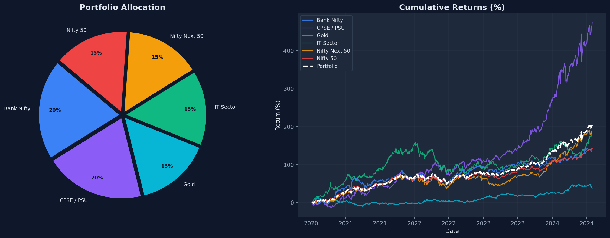
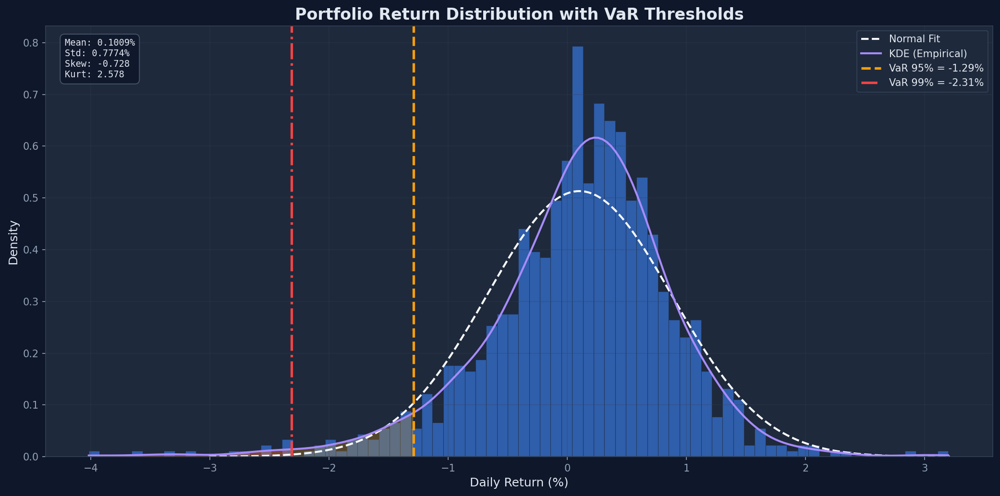
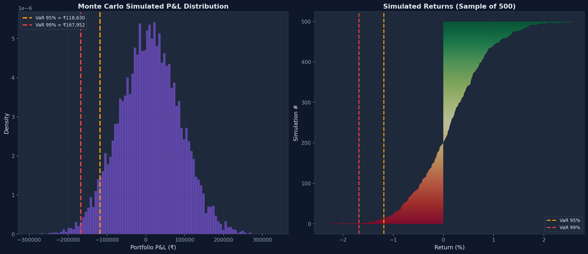
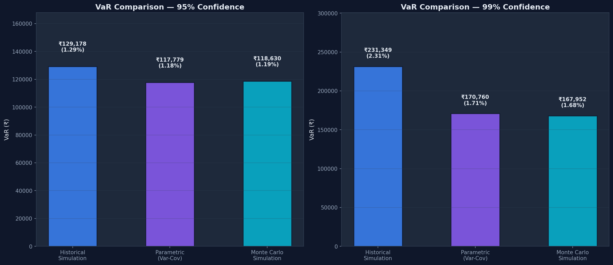
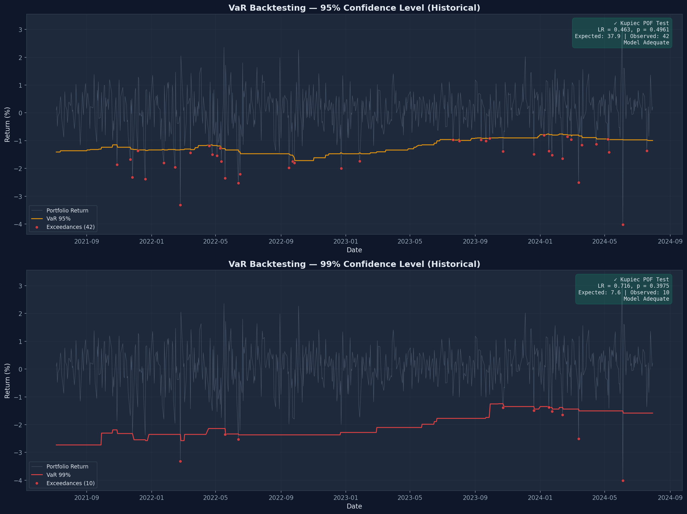
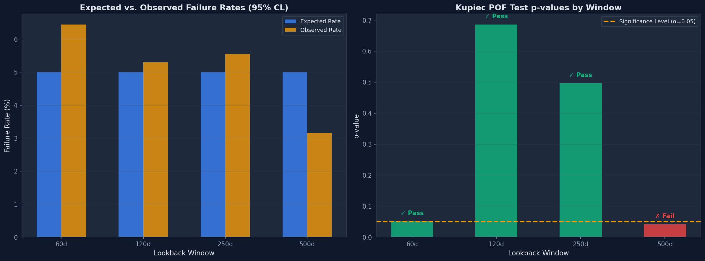
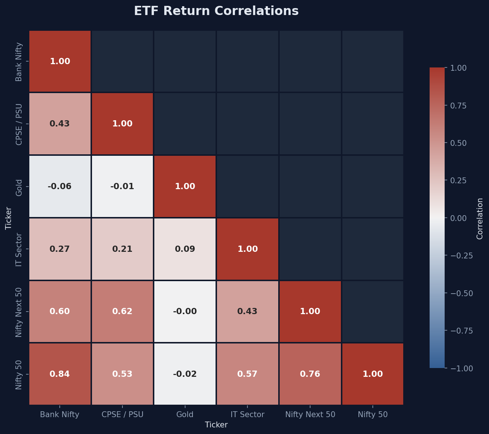

<](https://python.org)
[](https://numpy.org)
[](https://pandas.pydata.org)
[](https://scipy.org)
[](LICENSE)

*Estimates Value-at-Risk using Historical, Parametric, and Monte Carlo methods for a diversified NIFTY sector ETF portfolio, with statistical backtesting via Kupiec's Proportion of Failures test.*

</div>

---

## 🎯 Overview

This project implements a complete **VaR estimation and validation pipeline** for a diversified portfolio of 6 Indian (NIFTY) sector ETFs. It answers the core risk management question:

> *"What is the maximum expected loss on this portfolio over a single trading day, at a given confidence level?"*

The framework computes VaR using three independent methods, then rigorously backtests the forecasts using Kupiec's likelihood-ratio test to verify whether the models are statistically adequate.

### Key Results

| Metric | 95% Confidence | 99% Confidence |
|--------|:--------------:|:--------------:|
| **Historical VaR** | ₹1,29,178 (1.29%) | ₹2,31,349 (2.31%) |
| **Parametric VaR** | ₹1,17,779 (1.18%) | ₹1,70,760 (1.71%) |
| **Monte Carlo VaR** | ₹1,18,630 (1.19%) | ₹1,67,952 (1.68%) |
| **Kupiec POF Test** | ✅ Model Adequate (p=0.4961) | ✅ Model Adequate (p=0.3975) |

> Portfolio Value: ₹1,00,00,000 (₹1 Crore) · Data: Jan 2020 – Jul 2024

---

## 📈 Visualizations

### Portfolio Allocation & Cumulative Returns
<p align="center">
  
</p>

### Return Distribution with VaR Thresholds
<p align="center">
  
</p>

The return distribution exhibits **negative skewness (-0.728)** and **excess kurtosis (2.578)**, indicating heavier left tails than a normal distribution — a key motivation for using Historical and Monte Carlo VaR alongside the Parametric method.

### Monte Carlo Simulation (10,000 Paths)
<p align="center">
  
</p>

### VaR Comparison Across Methods
<p align="center">
  
</p>

### Backtesting — Rolling VaR with Exceedances
<p align="center">
  
</p>

Both confidence levels pass the Kupiec POF test, confirming the Historical VaR model is statistically adequate for this portfolio.

### Window Length Calibration
<p align="center">
  
</p>

### ETF Return Correlation Matrix
<p align="center">
  
</p>

Gold (GOLDBEES) shows near-zero correlation with equity ETFs, confirming its role as a portfolio diversifier.

---

## 🧮 Methodology

### 1. Value-at-Risk (VaR)

VaR estimates the maximum expected loss over a given time horizon at a specified confidence level. Three methods are implemented:

#### Historical Simulation
Uses the empirical percentile of past returns — no distributional assumptions.

$$\text{VaR}_\alpha = -\text{Percentile}(R, \alpha \times 100)$$

#### Parametric (Variance-Covariance)
Assumes normally distributed returns:

$$\text{VaR}_\alpha = -(\mu + z_\alpha \cdot \sigma)$$

where $z_\alpha$ is the standard normal quantile at significance level $\alpha$.

#### Monte Carlo Simulation
Generates 10,000 correlated random return paths using **Cholesky decomposition** of the covariance matrix:

$$\mathbf{R}_{\text{sim}} = \mathbf{Z} \cdot \mathbf{L}^T + \boldsymbol{\mu}$$

where $\mathbf{L}$ is the lower-triangular Cholesky factor of the covariance matrix $\Sigma = \mathbf{L}\mathbf{L}^T$, and $\mathbf{Z} \sim \mathcal{N}(0, I)$.

### 2. Backtesting — Kupiec's POF Test

The Proportion of Failures (POF) test evaluates whether the number of VaR exceedances is statistically consistent with the chosen confidence level.

**Hypotheses:**
- $H_0$: Observed failure rate = Expected failure rate $(1 - \text{CL})$
- $H_1$: Observed failure rate $\neq$ Expected failure rate

**Likelihood Ratio Statistic:**

$$LR_{POF} = -2 \ln\left[\frac{(1-p)^{T-x} \cdot p^x}{(1-\hat{p})^{T-x} \cdot \hat{p}^x}\right]$$

where $p = 1 - \text{CL}$ (expected), $\hat{p} = x/T$ (observed), $x$ = failures, $T$ = total observations.

Under $H_0$, $LR_{POF} \sim \chi^2(1)$. Reject $H_0$ if p-value < 0.05.

### 3. Window Calibration

Tests multiple lookback windows (60, 120, 250, 500 trading days) to determine which window produces the most accurate VaR forecasts, evaluated via the Kupiec test p-value.

---

## 🏗️ Project Structure

```
Portfolio-VaR-Simulation-and-Backtesting/
│
├── config.py              # All configurable parameters (tickers, weights, confidence levels)
├── data_loader.py         # Fetches NIFTY ETF data via yfinance, computes log returns
├── var_models.py          # VaR estimation: Historical, Parametric, Monte Carlo
├── backtesting.py         # Kupiec's POF test, rolling VaR, window calibration
├── visualization.py       # 7 publication-quality dark-themed charts
├── main.py                # Orchestrates the full pipeline
│
├── requirements.txt       # Python dependencies
├── output/                # Generated charts (auto-created on run)
│   ├── 01_portfolio_composition.png
│   ├── 02_return_distribution.png
│   ├── 03_monte_carlo.png
│   ├── 04_var_comparison.png
│   ├── 05_backtest_results.png
│   ├── 06_window_calibration.png
│   └── 07_correlation_heatmap.png
│
└── README.md
```

---

## 📊 Portfolio Composition

| ETF Ticker | Sector | Weight | Role |
|:----------:|:------:|:------:|:----:|
| `NIFTYBEES.NS` | Nifty 50 Index | 20% | Core equity exposure |
| `BANKBEES.NS` | Banking | 20% | Financials exposure |
| `ITBEES.NS` | IT Sector | 15% | Technology exposure |
| `CPSEETF.NS` | CPSE / PSU | 15% | PSU / Energy exposure |
| `JUNIORBEES.NS` | Nifty Next 50 | 15% | Mid-cap diversification |
| `GOLDBEES.NS` | Gold | 15% | Hedge / Safe haven |

---

## 🚀 Quick Start

### Prerequisites
- Python 3.9+
- Internet connection (for fetching market data)

### Installation

```bash
# Clone the repository
git clone https://github.com/shreyansh-jain/Portfolio-VaR-Simulation-Backtesting.git
cd Portfolio-VaR-Simulation-Backtesting

# Create virtual environment (recommended)
python -m venv venv
venv\Scripts\activate          # Windows
source venv/bin/activate       # macOS/Linux

# Install dependencies
pip install -r requirements.txt
```

### Run

```bash
python main.py
```

The script will:
1. 📥 Download historical price data for all 6 NIFTY sector ETFs
2. 📊 Compute VaR using Historical, Parametric, and Monte Carlo methods
3. 🧪 Backtest VaR forecasts using Kupiec's POF Test
4. 🔧 Calibrate lookback window lengths
5. 🎨 Generate 7 publication-quality visualizations in `output/`

---

## ⚙️ Configuration

All parameters are centralized in [`config.py`](config.py):

```python
# Confidence levels
CONFIDENCE_LEVELS = [0.95, 0.99]

# Monte Carlo settings
NUM_SIMULATIONS = 10_000
RANDOM_SEED = 42

# Backtesting
LOOKBACK_WINDOWS = [60, 120, 250, 500]
DEFAULT_LOOKBACK = 250     # ~1 trading year

# Portfolio
PORTFOLIO_VALUE = 10_000_000  # ₹1 Crore
```

---

## 🛠️ Tech Stack

| Library | Version | Purpose |
|:-------:|:-------:|:-------:|
| **NumPy** | ≥1.24 | Array operations, Cholesky decomposition, random simulation |
| **Pandas** | ≥2.0 | Time-series data handling, rolling computations |
| **SciPy** | ≥1.11 | Normal distribution quantiles, χ² test for Kupiec's POF |
| **Matplotlib** | ≥3.7 | Publication-quality visualizations with dark theme |
| **Seaborn** | ≥0.12 | Correlation heatmap |
| **yfinance** | ≥0.2.28 | Historical NIFTY ETF price data from Yahoo Finance |

---

## 📚 References

- Jorion, P. (2006). *Value at Risk: The New Benchmark for Managing Financial Risk*. McGraw-Hill.
- Kupiec, P. (1995). *Techniques for Verifying the Accuracy of Risk Measurement Models*. Journal of Derivatives.
- Hull, J.C. (2018). *Options, Futures, and Other Derivatives*. Pearson.

---

## 📄 License

This project is licensed under the MIT License — see the [LICENSE](LICENSE) file for details.

---

<div align="center">

**Built with ❤️ for quantitative finance**

*If you found this useful, consider giving it a ⭐*

</div>
]]>
